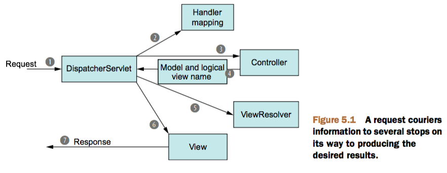

Spring Web
--

#### 跟踪 Spring MVC 的请求


1. Request : 带有用户请求的信息, 至少会包含请求的 URL。

2. DispatcherServlet : SpringMVC 与大多数 Java 的 Web 框架一样, 所有的请求都会经过一个前端控制器 Servlet;
前端控制器是常用的 Web 应用程序模式, 在这里单例的 Servlet 将请求委托给应用程序的其他组件来执行实际的处理。
在 SpringMVC 中 DispatcherServlet 就是前端控制器。

3. HandlerMapping : DispatcherServlet 查询一个或多个处理器映射 HandlerMapping 来确定请求的一个站在哪里,
处理器映射会根据请求所携带的URL信息来进行决策。

4. Controller : 一旦选择了合适的 Controller, DispatcherServlet 会将请求发送给选中的控制器, 到了控制器, 请求会卸下其负载(用户提交的信息)
并耐心等待控制器处理这些信息。

5. Model & Logical view name : Controller 完成逻辑处理后, 通常会产生一些信息, 这些信息需要返回给用户并在浏览器上显示。这些信息被称为模型(Model)。
不过仅仅给用户返回原始的信息是不够的--这些信息需要以用户友好的方式进行格式化,一般会是HTML。所以,信息需要发送给一个视图(View),通常会是JSP。

6. Controller : Controller 所做的最后一件事情就是将模型数据打包,并且标示出用于渲染输出的视图名; 它接下来会将请求联通模型和视图名发送回 DispatcherServlet。

7. ViewResolver : DispatcherServlet 将会使用视图解析器(ViewResolver)来将逻辑视图名匹配为一个特定的视图实现, 他可能是JSP 。

8. View : DispatcherServlet 已经知道由哪一个视图渲染结果, 那请求的任务基本上也就完成了; 它的最后一站就是视图的实现, 在这里它交付模型数据, 请求的任务就完成了。

9. Response : 视图将使用模型数据输出, 这个输出会通过响应对象传递给客户端。

### Bootstrap

```java
package me.caiyuan.spring.web.config;

public class WebAppInitializer extends AbstractAnnotationConfigDispatcherServletInitializer {

    protected Class<?>[] getRootConfigClasses() {
        return new Class<?>[]{RootConfig.class};
    }

    protected Class<?>[] getServletConfigClasses() {
        return new Class<?>[]{WebConfig.class};
    }

    protected String[] getServletMappings() {
        return new String[]{"/"};
    }
}
```
```java
package me.caiyuan.spring.web.config;

@Configuration
@ComponentScan(
        basePackageClasses = RootPackage.class,
        excludeFilters = {@Filter(type = ANNOTATION, value = EnableWebMvc.class)})
public class RootConfig {
}
```
```java
package me.caiyuan.spring.web.config;

@Configuration
@EnableWebMvc
@ComponentScan(basePackageClasses = WebPackage.class)
public class WebConfig extends WebMvcConfigurerAdapter {

    @Bean
    public ViewResolver viewResolver() {
        InternalResourceViewResolver resolver =
                new InternalResourceViewResolver();
        resolver.setPrefix("/WEB-INF/views/");
        resolver.setSuffix(".jsp");
        resolver.setExposeContextBeansAsAttributes(true);
        return resolver;
    }

    @Override
    public void configureDefaultServletHandling(DefaultServletHandlerConfigurer configurer) {
        configurer.enable();
    }
}
```
```java
package me.caiyuan.spring.web.controller;

public interface WebPackage {
}
```
```java
package me.caiyuan.spring.web;

public interface RootPackage {
}
```
```java
package me.caiyuan.spring.web.controller;

@Controller
public class HomeController {

    @RequestMapping(value = "/", method = GET)
    public String home() {
        return "home";
    }
}
```
```jsp
<!-- /WEB-INF/views/home.jsp -->
<%@ page contentType="text/html;charset=UTF-8" language="java" %>
<html>
<head>
    <title>Home</title>
</head>
<body>
spring-web
</body>
</html>
```
<!-- /WEB-INF/views/home.jsp -->

