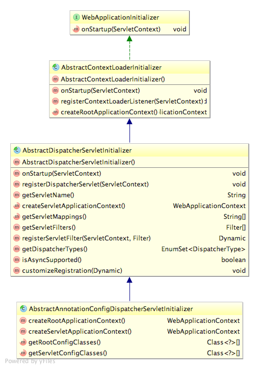
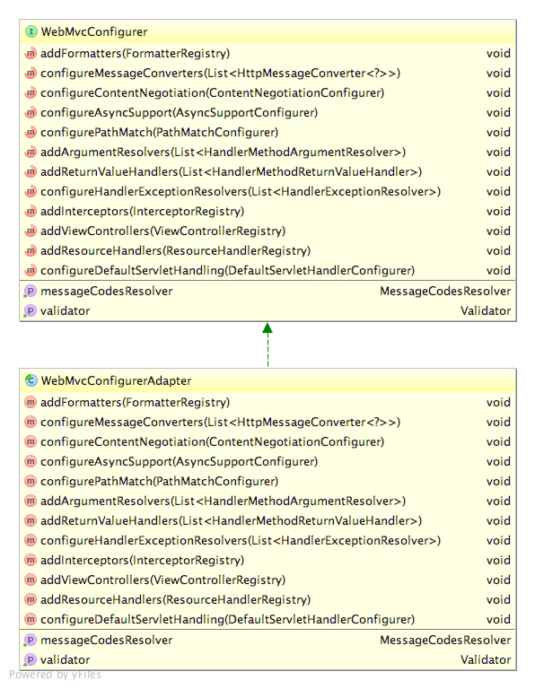
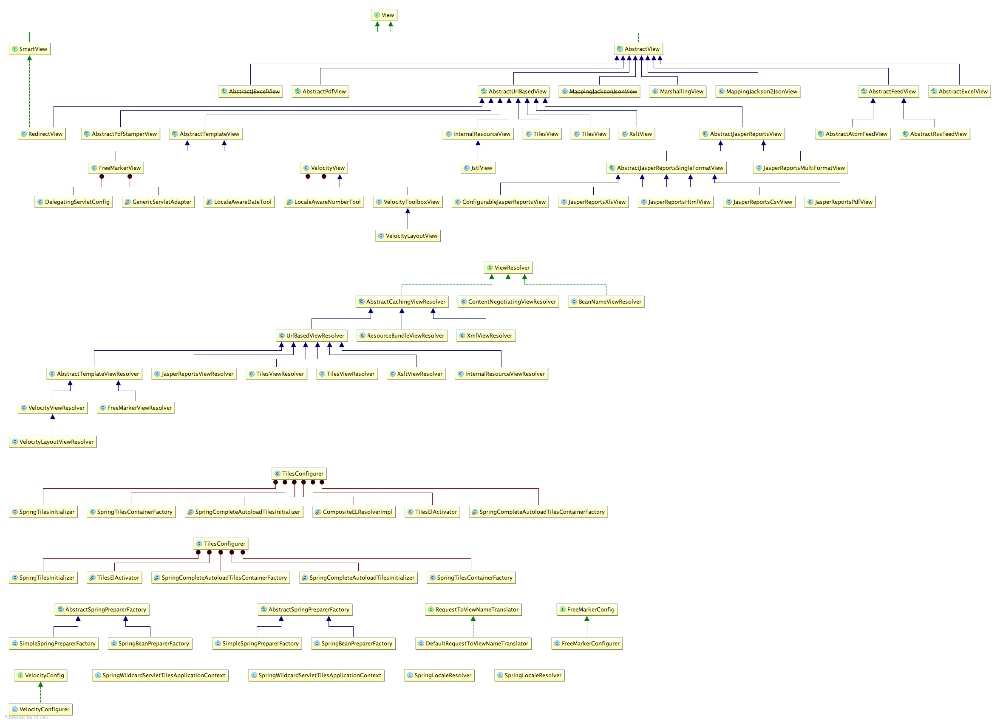
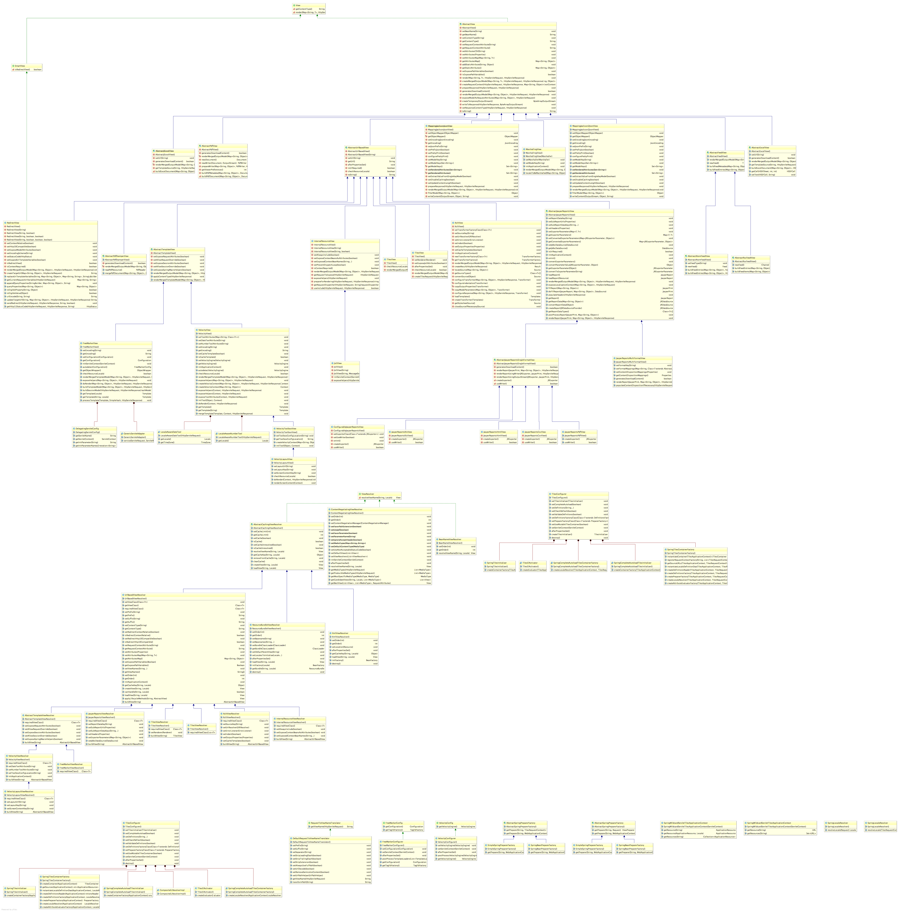

### Diagram

#### WebApplicationInitializer



#### WebMvcConfigurer



#### View




### Extension

#### MappingJackson2JsonView

```xml
<dependencies>
    <dependency>
        <groupId>com.fasterxml.jackson.core</groupId>
        <artifactId>jackson-core</artifactId>
        <version>2.7.5</version>
    </dependency>
    <dependency>
        <groupId>com.fasterxml.jackson.core</groupId>
        <artifactId>jackson-databind</artifactId>
        <version>2.7.5</version>
    </dependency>
</dependencies>
```

```java
// WebConfig

@Bean
public MappingJackson2JsonView mappingJackson2JsonView() {
    return new MappingJackson2JsonView();
}

// Controller

@Controller
public class JsonResponseController {

    @ResponseBody
    @RequestMapping("json")
    public Object json() {
        return Arrays.asList("value1", "value2", "value3", "value4", "value5");
    }

}
```

#### 添加其它 Servlet 和 Filter

基于Java的初始化器(initializer)的一个好处就在于我们定义任意数量的初始化器;因此,如果我们想往Web容器中注册其它组件的话,只需创建一个新的初始化器就可以了;
最简单的方法就是实现Spring的WebApplicationInitializer。

```java
@Configuration
@EnableWebMvc
@ComponentScan(basePackageClasses = WebPackage.class)
public class WebConfig extends WebMvcConfigurerAdapter implements WebApplicationInitializer {
    // other ...
    
    @Override
    public void onStartup(ServletContext servletContext) throws ServletException {
        ServletRegistration.Dynamic customServlet = servletContext.addServlet("customServlet", CustomServlet.class);
        customServlet.addMapping("/customServlet");

        FilterRegistration.Dynamic customFilter = servletContext.addFilter("customFilter", CustomFilter.class);
        customFilter.addMappingForServletNames(null, false, "customServlet");
    }
}
```

> 如果只是注册 Filter ,并且该 Filter 映射到 DispatcherServlet 上的话,所需做的仅仅重载 AbstractDispatcherServletInitializer 的 getServletFilters 方法。

```java
@Override
protected Filter[] getServletFilters() {
    return new Filter[]{new CustomFilter()};
}
```
