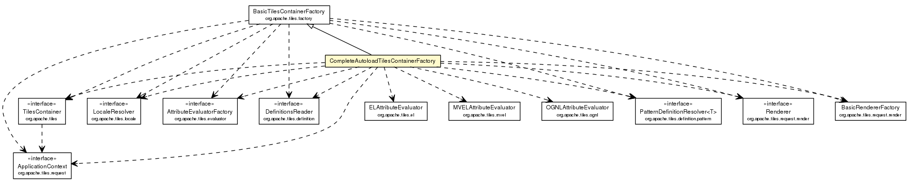

Spring Titles
--

> 使用 <a href="http://tiles.apache.org/framework/tutorial/index.html">Apache Titles 3 </a>
> <div>
>     <h4>Introduction</h4>
>     <p>This tutorial is intended to provide a help for first-time Tiles users, in the context of a web application.</p>
>     <div class="section">
>         <h4>Summary<a name="Summary"></a></42>
>         <ol style="list-style-type: decimal">
>             <li><a href="http://tiles.apache.org/framework/tutorial/pattern.html">The "composite view" pattern</a></li>
>             <li><a href="http://tiles.apache.org/framework/tutorial/configuration.html">Configuring your web application</a></li>
>             <li><a href="http://tiles.apache.org/framework/tutorial/basic/index.html">Basic Usage</a>
>                 <ol style="list-style-type: decimal">
>                     <li><a href="http://tiles.apache.org/framework/tutorial/basic/concepts.html">Tiles Concepts</a></li>
>                     <li><a href="http://tiles.apache.org/framework/tutorial/basic/pages.html">Creating Tiles Pages</a></li>
>                 </ol>
>             </li>
>             <li><a href="http://tiles.apache.org/framework/tutorial/advanced/index.html">Advanced Topics</a>
>                 <ol style="list-style-type: decimal">
>                     <li><a href="http://tiles.apache.org/framework/tutorial/advanced/nesting-extending.html">Nesting and Extending Definitions</a></li>
>                     <li><a href="http://tiles.apache.org/framework/tutorial/advanced/list-attributes.html">List Attributes</a></li>
>                     <li><a href="http://tiles.apache.org/framework/tutorial/advanced/runtime.html">Runtime Composition</a></li>
>                     <li><a href="http://tiles.apache.org/framework/tutorial/advanced/preparer.html">View Preparers</a></li>
>                     <li><a href="http://tiles.apache.org/framework/tutorial/advanced/utils.html">Rendering Utilities</a></li>
>                     <li><a href="http://tiles.apache.org/framework/tutorial/advanced/l10n.html">Tiles Localization</a></li>
>                     <li><a href="http://tiles.apache.org/framework/tutorial/advanced/wildcard.html">Wildcard support</a></li>
>                     <li><a href="http://tiles.apache.org/framework/tutorial/advanced/el-support.html">EL support</a></li>
>                     <li><a href="http://tiles.apache.org/framework/tutorial/advanced/attribute-rendering.html">Attribute rendering</a></li>
>                     <li><a href="http://tiles.apache.org/framework/tutorial/advanced/multiple-containers.html">Using multiple containers</a></li>
>                     <li><a href="http://tiles.apache.org/framework/tutorial/advanced/security.html">Security</a></li>
>                 </ol>
>             </li>
>             <li><a href="http://tiles.apache.org/framework/tutorial/integration/index.html">Integration with other technologies</a>
>                 <ol style="list-style-type: decimal">
>                     <li><a href="http://tiles.apache.org/framework/tutorial/integration/frameworks.html">Integration with other frameworks</a></li>
>                     <li><a href="http://tiles.apache.org/framework/tutorial/integration/view.html">Integration with other view technologies</a></li>
>                 </ol>
>             </li>
>         </ol>
>     </div>
> </div>
>
> #### Tips
>
> 1). CompleteAutoloadTilesContainerFactory
>
> 
>
> <div class="block">Tiles container factory that:
>     <ul>
>         <li>create supporting objects for Velocity and FreeMarker;</li>
>         <li>create renderers for Velocity, FreeMarker, and Mustache templates;</li>
>         <li>allows using EL, MVEL and OGNL as attribute expressions;</li>
>         <li>allows using Wildcards and Regular Expressions in definition names;</li>
>         <li>loads Tiles 1.x definition files;</li>
>         <li>loads all the definition files that have the "tiles*.xml" pattern under
>             <code>/WEB-INF</code> directory (and subdirectories) and under
>             <code>META-INF</code> directories (and subdirectories) in every jar.
>         </li>
>     </ul>
> </div>

- Tiles 3 as a Maven dependency

```xml
<!--The complete Tiles dependency with all supported technologies is achievable with the following dependency declaration:-->
  <dependency>
    <groupId>org.apache.tiles</groupId>
    <artifactId>tiles-extras</artifactId>
    <version>3.0.5</version>
  </dependency>

<!--The basic Tiles dependency with only servlet support can be added this way:-->
  <dependency>
    <groupId>org.apache.tiles</groupId>
    <artifactId>tiles-servlet</artifactId>
    <version>3.0.5</version>
  </dependency>

<!--If you need a dependency to Tiles JSP support, Declare the dependency this way:-->
  <dependency>
    <groupId>org.apache.tiles</groupId>
    <artifactId>tiles-jsp</artifactId>
    <version>3.0.5</version>
  </dependency>
```

```text
当配置TilesConfiguration的时候，所要设置的最重要的属性就是definitions；
这个属性接受一个String数组，其中每一条都指定一个Tile定义的XML文件。(对于Spring来讲，我们在"/WEB-INF/layout/"目录下查找tiles.xml）
```

- JavaConfig 配置方式
```java
	// 配置 TilesConfigurer 类解析 Tile 定义
    @Bean
    public TilesConfigurer tilesConfigurer() {
        TilesConfigurer tiles = new TilesConfigurer();
        tiles.setDefinitions("/WEB-INF/layout/tiles.xml");
        
        // 参见: CompleteAutoloadTilesContainerFactory
        // tiles.setCompleteAutoload(true);
        // 遍历"/WEB-INF/"的所有子目录来查找Tile定义
	    // tiles.setDefinitions("/WEB-INF/**/tiles.xml");
	    // 配置多个Tile定义的文件源
	    // tiles.setDefinitions("/WEB-INF/layout/tiles.xml", "/WEB-INF/views/**/tiles.xml");

        tiles.setCheckRefresh(true);
        return tiles;
    }

	// 配置 TilesViewResolver 渲染
    @Bean
    public TilesViewResolver tilesViewResolver() {
        return new TilesViewResolver();
    }
```
- XMLConfig 配置方式
```xml
    <bean id="tilesConfigurer" class="org.springframework.web.servlet.view.tiles3.TilesConfigurer">
        <property name="definitions">
            <list>
                <value>/WEB-INF/layout/tiles.xml</value>
                <!--<value>/WEB-INF/views/**/tiles.xml</value>-->
            </list>
        </property>
    </bean>

    <bean id="tilesViewResolver" class="org.springframework.web.servlet.view.tiles3.TilesViewResolver"/>
```

- 定义 Tiles

```text
Apache Tiles 提供了文档类型定义（DTD），用来在XML文件中指定Tile的定义；每个定义文件中需要包含一个<definition>元素，这个元素会有一个或多个<put-attribute>元素。
每个<definition>元素都定义了一个Tile，它最终引用的是一个JSP模板；某个Tiles还可能引用其他的JSP模板，使用这些JSP模板嵌入到主模板中。
```

```xml
<?xml version="1.0" encoding="ISO-8859-1" ?>
<!DOCTYPE tiles-definitions PUBLIC
        "-//Apache Software Foundation//DTD Tiles Configuration 3.0//EN"
        "http://tiles.apache.org/dtds/tiles-config_3_0.dtd">
<tiles-definitions>

    <definition name="base" template="/WEB-INF/layout/page.jsp">
        <put-attribute name="header" value="/WEB-INF/layout/header.jsp"/>
        <put-attribute name="footer" value="/WEB-INF/layout/footer.jsp"/>
    </definition>

	<!-- registerForm 扩展自 base -->
    <definition name="registerForm" extends="base">
        <put-attribute name="body" value="/WEB-INF/views/registerForm.jsp"/>
        <put-attribute name="el">
            <!-- 匿名的嵌套定义 -->
            <definition template="el.jsp">
                <!--使用 el 表达式 -->
                <put-attribute name="inline" expression="1 + 3 = ${1+3}"/>
            </definition>
        </put-attribute>
    </definition>
	<!-- 上面的 registerForm 相当于下面的配置 -->
    <!--
    <definition name="registerForm" template="/WEB-INF/layout/page.jsp">
    	<put-attribute name="header" value="/WEB-INF/layout/header.jsp"/>
        <put-attribute name="footer" value="/WEB-INF/layout/footer.jsp"/>
        <put-attribute name="body" value="/WEB-INF/views/registerForm.jsp"/>
        <put-attribute name="el" expression="1 + 2 = ${1+2}"/></definition>
    </definition>
    -->

</tiles-definitions>
```
