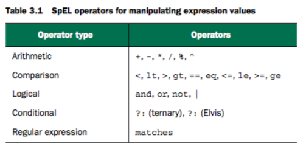
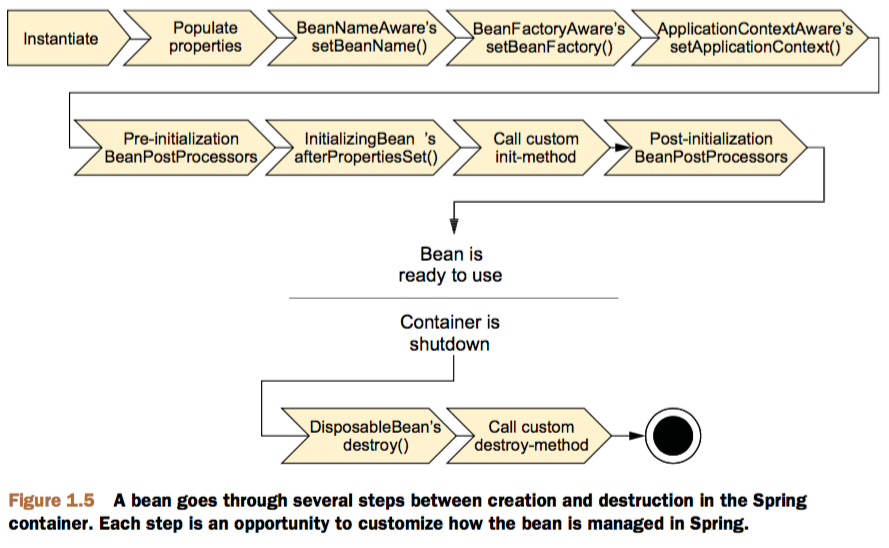

### JavaConfig , XmlConfig 混合使用

- 方案一
```java
    public class A {
    }

    public class Obj {
        @Autowired
        public A a;
    }
```
```xml
    <!--
        <context:annotation-config/> 用于激活那些已经在 spring 容器里注册过的 bean（无论是通过 xml 的方式还是通过 package scan 的方式）上面的注解(如: @Autowired 等等).
    -->
    <context:annotation-config/>

    <bean class="me.caiyuan.spring.base.pkg1.A"/>
    <bean id="obj" class="me.caiyuan.spring.base.pkg2.Obj"/>
```

- 方案二
```java
    @Component
    public class A {
    }

    @Component
    public class Obj {
        @Autowired
        public A a;
    }
```
```xml
    <!--
        <context:component-scan> 除了具有 <context:annotation-config> 的功能之外, 还可以在指定的 package 下扫描以及注册 JavaBean 。
    -->
    <context:component-scan base-package="me.caiyuan.spring.base.pkg1, me.caiyuan.spring.base.pkg2"/>
```

### @Profile 配置切换
- @Profile 注解基于 @Conditional 和 Condition 实现
- Source Code
```java
    @Retention(RetentionPolicy.RUNTIME)
    @Target({ElementType.TYPE, ElementType.METHOD})
    @Documented
    @Conditional(ProfileCondition.class)
    public @interface Profile {
        String[] value();
    }

    class ProfileCondition implements Condition {
        @Override
        public boolean matches(ConditionContext context, AnnotatedTypeMetadata metadata) {
            if (context.getEnvironment() != null) {
                MultiValueMap<String, Object> attrs = metadata.getAllAnnotationAttributes(Profile.class.getName());
                if (attrs != null) {
                    for (Object value : attrs.get("value")) {
                        if (context.getEnvironment().acceptsProfiles(((String[]) value))) {
                            return true;
                        }
                    }
                    return false;
                }
            }
            return true;
        }
    }
```

### Scope bean作用域
Spring 定义了多种作用域,可已基于这些作用域创建 bean,包括:
- 单例(Singleton): 在整个应用中,只创建bean的一个实例
- 原型(Prototype): 每次注入或者通过Spring应用上下文获取的时候,都会创建一个新的bean实例
- 会话(Session): 在Web应用中,为每个会话创建一个bean实例
- 请求(Request): 在Web应用中,为每个请求创建一个bean实例

```java
    @Scope(value = WebApplicationContext.SCOPE_SESSION, proxyMode = ScopedProxyMode.INTERFACES)
    // @scope 同时还有一个 proxyMode 属性, 他被设置成 ScopedProxyMode.INTERFACES。这个属性解决了将会话或请求作用域的 bean 注入到单例 bean 中所遇到的问题。
```


### Placeholder 属性占位符
声明使用 PropertySourcesPlaceholderConfigurer 解析属性占位符 ${...}

- JavaConfig
```java
    @Configuration
    @PropertySource({"classpath:Externals1.properties", "classpath:Externals2.properties"})
    public class EnvironmentAndPlaceholderConfig {
        @Bean
        public static PropertySourcesPlaceholderConfigurer placeholderConfigurer() {
            return new PropertySourcesPlaceholderConfigurer();
        }
    }
```

- XmlConfig
```xml
    <context:property-placeholder location="Externals1.properties" order="1"/>
    <context:property-placeholder location="Externals2.properties" order="2"/>
```

### SpEL spring表达式语言
SpEL 表达式放置于 #{...} 拥有很多特性,包括:
- 使用bean的id来引用bean;
- 调用方法和访问对象的属性;
- 对值进行算术,关系和逻辑运算;
- 正则表达式匹配;
- 集合操作;
```java
    // T()表达式会将java.lang.System视为Java中对应的类型,因此可以调用其static修饰的currentTimeMillis()方法(或属性)
    #{T(System).currentTimeMillis()}
    // 通过systemProperties对象引用系统属性
    #{systemProperties['disc.title']}
    // 得到id为sgtPeppers的bean
    #{sgtPeppers}
    // 得到id为sgtPeppers的bean的artist属性
    #{sgtPeppers.artist}
    // 调用id为sgtPeppers的bean的getArtist()方法
    #{sgtPeppers.getArtist()}

    // 表示字面值
    #{3.14159}
    #{9.87E4} //科学计数法
    #{'Hello'}
    #{false}

    // (.? 运算符) 如果 artistSelector.selectArtist() 的返回值不为 null 则调用 toUpperCase() 方法, 否则直接返回 null 值
    #{artistSelector.selectArtist()?.toUpperCase()}
```
```java
    public BlankDisk(
        @Value("#{systemProperties['disc.title']}") String title,
        @Value("#{systemProperties['disc.artist']}") String artist) {
        this.title = title;
        this.artist = artist;
    }
```
```xml
    <bean id="sgtPeppers" class="myPackage.BlankDisk"
            c:_title="#{systemProperties['disc.title']}"
            c:_artist="#{#{systemProperties['disc.artist']}"/>
```



```java
    // 算术运算符
    #{2 * T(java.lang.Math).PI * circle.radius}
    // 字符连接符
    #{disc.title + ' by ' + disc.artist}
    // 比较运算符
    #{counter.total == 100}
    #{counter.total eq 100}
    // 三元运算符
    #{scoreboard.score > 1000 ? "Winner!" : "Loser"}
    // 条件运算符; 如果 disc.title 的值为 null 则返回 'Rattle and Hum', 否则返回 disc.title 的值
    #{disc.title ?: 'Rattle and Hum'}
    // 正则表达式; matches, 匹配成功则返回 true 否则返回 false
    #{admin.email matches '[a-zA-Z0-9._%+-]+@[a-zA-Z0-9.-]+\\.com'}
```

```java
    // 计算集合

    // [] 选择运算符
    #{jukebox.songs[4].title}
    #{jukebox.songs[T(java.lang.Math).random() * jukebox.songs.size()].title}
    // 从String对象中获取一个字符, 这个表达式引用了String中的第四个(基于零开始)字符,也就是"s"
    #{'This is a test'[3]}

    // .?[] , .^[] , .$[] 查询运算符
    // 如果 jukebox.songs 的值不为 null , 则返回 jukebox.songs 集合中所有的对象的属性 artist 值为 'Aerosmith' 的对象。
    #{jukebox.songs.?[artist eq 'Aerosmith']}
    // 如果 jukebox.songs 的值不为 null , 则返回 jukebox.songs 集合中对象的属性 artist 值为 'Aerosmith' 的第一个对象。
    #{jukebox.songs.^[artist eq 'Aerosmith']}
    // 如果 jukebox.songs 的值不为 null , 则返回 jukebox.songs 集合中对象的属性 artist 值为 'Aerosmith' 的最后一个对象。
    #{jukebox.songs.$[artist eq 'Aerosmith']}

    // .![] 投影运算符
    // 如果 jukebox.songs 的值不为 null , 则返回 jukebox.songs 集合中所有的对象的属性 title 值, 并赋值到一个只存储 title 属性的新的集合中。
    #{jukebox.songs.![title]}
    // 返回 jukebox.songs 集合对象中属性 artist 值为 'Aerosmith' 的对象, 并返回所有符合条件的对象的 title 属性。
    #{jukebox.songs.?[artist eq 'Aerosmith'].![title]}
```

### Lifecycle bean生命周期
Bean装载到Spring应用上下文中的一个典型的生命周期过程



1. Spring 对 bean 进行实例化;
2. Spring 将值和 bean 的应用注入到 bean 对应的属性中;
3. 如果 bean 实现了 BeanNameAware 接口, Spring 将 bean 的 ID 传递给 setBeanName() 方法;
4. 如果 bean 实现了 BeanFactoryAware 接口, Spring 将调用 setBeanFactory() 方法, 将 BeanFactory 容器实例传入;
5. 如果 bean 实现了 ApplicationContextAware 接口, Spring 将调用它们的 setApplicationContext() 方法, 将 bean 所在应用上下文的引用传入进来;
6. 如果 bean 实现了 BeanPostProcessor 接口, Spring 将调用它们的 postProcessBeforeInitialization() 方法;
7. 如果 bean 实现了 InitializingBean 接口, Spring 将调用它们的 afterPropertiesSet() 方法。类似的, 如果 bean 使用 init-method 声明了初始化方法, 该方法也会被调用;
8. 如果 bean 实现了 BeanPostProcessor 接口, Spring 将调用它们的 postProcessAfterInitialization() 方法;
9. 此时, bean 已经准备就绪, 可以被应用程序使用了, 它们将一直驻留在应用上下文中, 知道该应用上下文被销毁;
10. 如果 bean 实现了 DisposableBean 接口, Spring 将调用它的 destroy() 接口方法。同样, 如果 bean 使用 destroy-method 声明了销毁方法, 该方法也会被调用;

```java
    // constructor -> init -> process -> destroy

    @Component
    public class BeanObject {

        public BeanObject() {
            System.out.println("constructor");
        }

        public void process() {
            System.out.println("process");
        }

        @PostConstruct
        public void init() {
            System.out.println("init");
        }

        @PreDestroy
        public void destroy() {
            System.out.println("destroy");
        }

    }
```

### SpringContext spring上下文
Spring 自带了多种类型的应用上下文
- AnnotationConfigApplicationContext: 从一个或多个基于Java的配置类中加载Spring应用上下文。
- AnnotationConfigWebApplicationContext: 从一个或多个基于Java的配置类中加载Spring Web应用上下文。
- ClassPathXmlApplicationContext: 从类路径下的一个或多个XML配置文件中加载上下文,把应用上下文的定义文件作为类资源。
- FileSystemXmlApplicationContext: 从文件系统下的一个或多个XML配置文件中加载上下文定义。
- XmlWebApplicationContext:  从Web应用下的一个或多个XML配置文件加载上下文定义。

### Springframework


